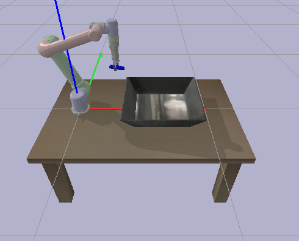

# ur_description

URDF of UR5 and RG2 for PyBullet and Isaac Gym. The files are extracted from [universal robot ROS packages](https://github.com/ros-industrial/universal_robot) and modified for usage in other simulators.



How to run:
```bash
python pybullet_example.py
```